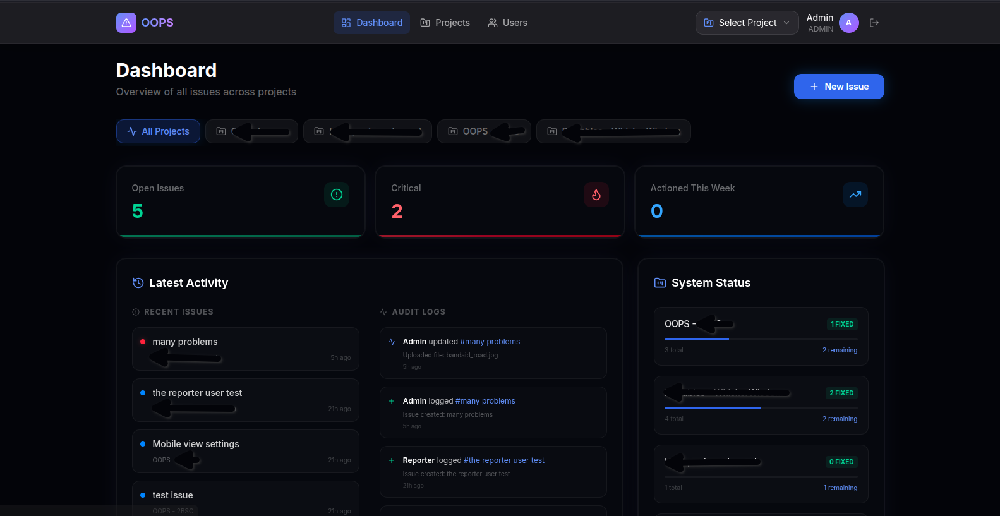

# OOPS - Project Issue Tracker

**O**bservations, **O**utages, **P**roblems and **S**uggestions



OOPS is a self-hosted issue tracker with a premium **dark-mode aesthetic** and **glassmorphism** UI. Track bugs, outages, feature requests, and general observations across your projects — all in one place.

## ✨ Key Features

- **📂 Project-Based Organisation**: Group issues by project for clean segregation.
- **🛡️ Role-Based Access Control**:
  - **Admins**: Full control over users, projects, and system settings.
  - **Reporters**: Can report issues, update their own tickets, and join discussions.
- **💬 Comments**: Discussion threads on every issue.
- **📎 Attachments**: Upload images, logs, and documents to issues.
- **📊 Dashboard**: High-level overview of system metrics and activity.
- **🌑 Dark UI**: Built with Tailwind CSS 4 and Lucide icons.

---

## 🚀 Quick Start — Docker (Recommended)

This is the easiest way to run OOPS. You do not need Node.js or any development tools.

### Step 1 — Install Docker

If Docker is not already installed on your machine:

- **Linux (Ubuntu/Debian)**:
  ```bash
  curl -fsSL https://get.docker.com | sh
  ```
  Then add your user to the docker group so you don't need sudo every time:
  ```bash
  sudo usermod -aG docker $USER
  ```
  Log out and back in for this to take effect.

- **Windows / Mac**: Download [Docker Desktop](https://www.docker.com/products/docker-desktop/)

Verify Docker is working:
```bash
docker --version
docker compose version
```

---

### Step 2 — Create a folder for the app

Pick a location on your server. `/opt` is conventional for self-hosted apps:
```bash
mkdir -p /opt/oops-tracker
cd /opt/oops-tracker
```

> You can use any folder, e.g. `~/oops-tracker` in your home directory works fine too.

---

### Step 3 — Create your compose file

Download the example compose file:
```bash
curl -o docker-compose.yml https://raw.githubusercontent.com/CrayziGomez/oops-tracker/main/docker-compose.example.yml
```

Or manually create a file called `docker-compose.yml` in your folder and paste in the contents of [docker-compose.example.yml](docker-compose.example.yml).

---

### Step 4 — Configure your settings

Open `docker-compose.yml` in a text editor and fill in the values:

```yaml
environment:
  - NEXTAUTH_SECRET=        # paste output of: openssl rand -base64 32
  - NEXTAUTH_URL=           # URL you'll use to access the app (see below)
  - SEED_ADMIN_PASSWORD=    # password for the admin login account
  - SEED_REPORTER_PASSWORD= # password for the reporter login account
```

**Setting `NEXTAUTH_URL`:**

| How you're accessing the app | Value to use |
|---|---|
| On the same machine | `http://localhost:3003` |
| From another device on your network | `http://YOUR-SERVER-IP:3003` (e.g. `http://192.168.1.10:3003`) |
| Via a domain name | `https://oops.yourdomain.com` |

To find your server's local IP: run `ip a` or `hostname -I`

**Generating a secret:**
```bash
openssl rand -base64 32
```
Copy the output and paste it as the value for `NEXTAUTH_SECRET`.

---

### Step 5 — Start the app

```bash
docker compose up -d
```

Docker will pull the image (~200MB) and start the container. This may take a minute on first run.

Check it started successfully:
```bash
docker compose logs -f
```
You should see `✓ Ready` near the end. Press `Ctrl+C` to stop watching logs (the app keeps running).

---

### Step 6 — Log in

Open your browser and go to the URL you set as `NEXTAUTH_URL`.

| Role | Email | Password |
|---|---|---|
| **Admin** | `admin@oops.local` | value of `SEED_ADMIN_PASSWORD` |
| **Reporter** | `reporter@oops.local` | value of `SEED_REPORTER_PASSWORD` |

> The email addresses can be customised — see the [Configuration](#configuration) section.

---

## ⚙️ Configuration

All settings are environment variables in your `docker-compose.yml`:

| Variable | Required | Description |
|---|---|---|
| `NEXTAUTH_SECRET` | ✅ | Random secret for session encryption. Generate with `openssl rand -base64 32` |
| `NEXTAUTH_URL` | ✅ | The URL you use to access the app in your browser |
| `AUTH_TRUST_HOST` | ✅ | Keep as `true` when using a reverse proxy or local network |
| `SEED_ADMIN_PASSWORD` | ✅ | Password for the admin account (set before first boot) |
| `SEED_REPORTER_PASSWORD` | ✅ | Password for the reporter account (set before first boot) |
| `SEED_ADMIN_EMAIL` | optional | Admin login email. Default: `admin@oops.local` |
| `SEED_REPORTER_EMAIL` | optional | Reporter login email. Default: `reporter@oops.local` |

> [!IMPORTANT]
> Seed passwords and emails are only applied **once**, on the very first boot when the database is created. To change them after that, update the account via the admin panel inside the app.

### Changing the port

The default port is `3003`. To change it, edit the `ports` line in your compose file:
```yaml
ports:
  - "8080:3000"  # left side is the host port — change this to whatever you want
```
Then update `NEXTAUTH_URL` to use the new port, e.g. `http://localhost:8080`.

### Persistent data

Two Docker volumes are created automatically and persist your data across restarts and updates:

| Volume | Contains |
|---|---|
| `oops_data` | The SQLite database (all issues, users, projects) |
| `oops_uploads` | Uploaded file attachments |

> Deleting these volumes will permanently erase all data. Don't run `docker compose down -v` unless you want to start fresh.

### Updating to a newer version

```bash
docker compose pull        # download the latest image
docker compose up -d       # restart with the new image
```

---

## 💻 Local Development

This section is for developers who want to modify the source code. If you just want to run the app, use Docker above.

### Requirements

- **Node.js 20 or higher** — do not install via `apt`, it gives an outdated version. Use `nvm` instead:
  ```bash
  # Install nvm
  curl -o- https://raw.githubusercontent.com/nvm-sh/nvm/v0.40.3/install.sh | bash
  # Reload shell
  source ~/.bashrc
  # Install and use Node 20
  nvm install 20
  nvm use 20
  # Verify
  node --version   # should show v20.x.x
  ```

- **Git**:
  ```bash
  sudo apt install git   # Ubuntu/Debian
  ```

### Setup

```bash
# 1. Clone the repository
git clone https://github.com/CrayziGomez/oops-tracker.git
cd oops-tracker

# 2. Install dependencies
npm install

# 3. Copy and configure the environment file
cp .env.example .env.local
# Edit .env.local with your values (see .env.example for descriptions)

# 4. Set up the database
npx prisma db push

# 5. Create the default users and sample data
npm run db:seed

# 6. Start the development server
npm run dev
```

Open `http://localhost:3000` in your browser.

---

## 🚢 Bare Metal Deployment

Running without Docker, directly on a server with Node.js installed:

```bash
npm run build
npm run start
```

You will need to run `npx prisma db push` and `npm run db:seed` manually before the first start.

---

## 🔧 Troubleshooting

**Login fails / "Invalid Redirect" error**
- Check that `NEXTAUTH_URL` exactly matches the URL in your browser including the port.

**Cannot connect from another device**
- Use your server's local IP address in `NEXTAUTH_URL`, not `localhost`. `localhost` only works on the same machine.

**Port already in use**
- Change the left-hand port number in `docker-compose.yml` and update `NEXTAUTH_URL` to match.

**Database error on startup**
- Docker volume permissions are fixed automatically on boot. If you see database errors, check `docker compose logs` for details.

---

## 📂 Project Structure

```
src/app/        Next.js routes and API endpoints
src/components/ UI components
src/lib/        Shared utilities (auth, database, storage)
prisma/         Database schema and seed script
public/uploads/ Uploaded file attachments (persisted via Docker volume)
docs/           Documentation assets (screenshots etc.)
```

## 🤝 Contributing

Fork the repository and submit a pull request. For major changes, open an issue first to discuss what you'd like to change.

## 📄 License

[MIT](https://choosealicense.com/licenses/mit/)
